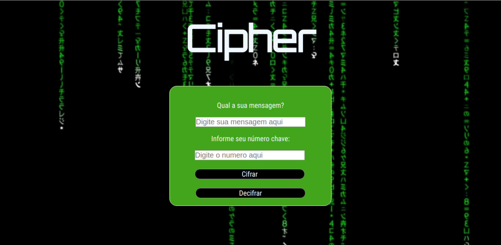
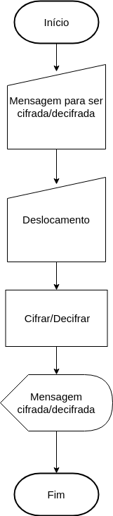
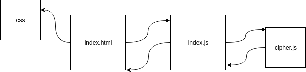

# Cifra de César

## Prefácio

Um grupo de amigos fãs de RPG (role-playing game), um tipo de jogo aonde os jogadores assumem papéis dos personagens dentro de um mundo de fantasia, decidem criar o próprio jogo aonde desejam se comunicar com mensagens secretas entre eles para que um time não possa tomar conhecimento da estratégia do outro. Sendo assim tendo a necessidade de um lugar onde pudessem criptografarem e descriptografarem as mensagens, com o objetivo de vencerem o jogo. 

## Introdução

A [cifra de César](https://pt.wikipedia.org/wiki/Cifra_de_C%C3%A9sar) é um dos
primeiros tipos de criptografias conhecidos na história. É um tipo de cifra por
substituição, em que uma letra no texto original é substituída por outra,
seguindo um número fixo para essa subtituição.

## Objetivos

Projeto proposto para as alunas do bootcamp Laboratória da turma do primeiro semestre de 2019.

O objetivo deste projeto foi de criar um produto capaz de criptografar e descriptografar uma mensagem dado um número de deslocamento e desenvolvido usando conhecimentos de User Experience Design e de JavaScript.
Dessa forma deveriamos:
- criá-lo pensando no usuário,
- criar uma interface,
- executar eventos básicos do DOM, 
- manipular o DOM para que ele imprima os resultados na tela,
- escrever uma lógica que cifra e decifra as mensagens inseridas pelo usuário,
- fazer testes que comprovem o funcionamento do código. 

## Definição de usuário

O usúario é um jogador de RPG que deseja criptografar e descriptografar mensagens de maneira fácil e rápida. Porém o programa é de fácil adaptação para outros tipos de usuário, como amigos que desejam usar para fazerem brincadeiras entre si, jogadores de outros tipos de jogos e pessoas que desejam enviar mensagens secretas entre si.

## Processo de desenvolvimento

- Fluoxograma: representando fluxo do usuário e do sistema.
- Html: definição dos elementos na tela.
- Css: apresentação dos elementos na tela.
- JavaScript: manipulação dos elementos na tela.


```text
./
├── .gitignore
├── README.md
├── src
│   ├── cipher.js
│   ├── index.html
│   ├── index.js
│   ├── style.css
│   └── tests.js
```


## Fluoxograma de Blocos



### Desenho do projeto




## Parte obrigatória

 - README.md com explicações e desenho do projeto
 - Usar VanillaJS.
 - Permitir escrever um texto, com letras maiúsculas e minúsculas, para ser cifrado.
 - Mostrar o resultado da cifra corretamente.
 - Permitir escrever um texto, com letras maiúsculas e minúsculas, para ser descifrado.
 - Mostrar o resultado descifrado corretamente.
 - Permitir escolher o offset (deslocamento) a ser usado na cifragem/descifragem.
 - Implementar cipher.encode.
 - Implementar cipher.decode.
 - Criar testes unitários.

## Parte Opcional: "Hacker edition"

 - Permite usar um `offset` (_deslocamento_) negativo
 - Cifra/descifra _outros_ caracteres (espaços, pontuação, `ã`, `á`, ...)


